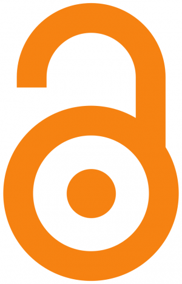

<figure></figure>

Ανάμεσα στις προετοιμασίες και τις συζητήσεις για τον φετινό εορτασμό της εθνικής επετείου, η <a href="http://www.openaccessweek.org/">Παγκόσμια Εβδομάδα Ανοικτής Πρόσβασης</a> (19-25 Οκτωβρίου) πέρασε μάλλον απαρατήρητη στην Ελλάδα. Κρίμα, γιατί νομίζω πως, ειδικά φέτος, η επετειακή αυτή πρωτοβουλία θα ήταν μια ιδανική αφορμή για να συζητήσουμε την Ανοικτή Πρόσβαση όχι ως μια ακόμη τεχνολογική τάση που ήρθε και θα περάσει, ή ως μια δημοφιλή προσθήκη στην ατζέντα της εκπαίδευσης και της έρευνας στις αρχές του 21ου αιώνα. Πιστεύω, αντίθετα, πως η Ανοικτή Πρόσβαση επιβάλλει μια τολμηρή αναστοχαστική κριτική και μια ανοιχτή συζήτηση γύρω από την επιστημονική δημοσίευση και επικοινωνία ως πεδία όπου τον τελευταίο σχεδόν αιώνα διαπλέκονται διανοητικές και πολιτισμικές συμβάσεις και πρακτικές, μέσα και φορείς, οικονομικές παράμετροι, δίκτυα εξουσίας και εξάρτησης που τροφοδοτούν και συστήνουν τον ακαδημαϊκό λόγο και τη γνώση. Στο πλαίσιο μιας τέτοιας προβληματικής μπορεί, νομίζω, να εξηγηθεί γιατί, ενώ η Ανοικτή Πρόσβαση σαν ιδέα είναι σχετικά απλή, (θα) συναντά πολλές δυσκολίες στην ευρύτερη και ωφέλιμη για όλους εφαρμογή της.&nbsp;

Για να το πω αλλιώς: καθώς έχουμε συστήσει και εμπεδώσει τις ακαδημαϊκές, ερευνητικές και επαγγελματικές μας συμπεριφορές, τα μέσα και τα προϊόντα της δραστηριότητάς μας σε ένα ισχυρό έντυπο παράδειγμα, δυσκολευόμαστε να διακρίνουμε τη φύση και τη λειτουργία των επιστημονικών δημοσιεύσεων και περιοδικών ως προς την επικοινωνία της γνώσης· να συζητήσουμε την ένταξή τους στην ατζέντα των εκδοτικών επιχειρήσεων και την πολλαπλά προβληματική σύνδεση μιας εμπορικής λογικής κόστους και κέρδους με την ακαδημαϊκή αξία, την ποιότητα και το κύρος· και, τέλος, να τολμήσουμε να φανταστούμε, συλλογικά και συνολικά, έναν οδικό χάρτη της ακαδημαϊκής επικοινωνίας αυτήν τη φορά στο ψηφιακό περιβάλλον με την ερευνητική κοινότητα ως κύριο συντελεστή.

Με ενδιαφέρει, και θα επικεντρώσω εδώ την ανάλυσή μου, η κατάσταση που καλείται να αντιμετωπίσει κυρίως η νέα ερευνήτρια και ο νέος ερευνητής στο χώρο των Ανθρωπιστικών Επιστημών στην Ελλάδα, καθώς όχι μόνο αυτή είναι εν μέρει η προσωπική μου εμπειρία αλλά επιπλέον όλα δείχνουν πως ένας ολοένα αυξανόμενος αριθμός νέων επιστημόνων με πρωτότυπη έρευνα και εντυπωσιακά ευρεία γκάμα ακαδημαϊκών ικανοτήτων λειτουργεί στις παρυφές ή μένει εκτός της (ακαδημαϊκής και μη) αγοράς εργασίας ακριβώς γιατί προσκρούει στο «παγόβουνο» των ακαδημαϊκών δημοσιεύσεων.
**Ρέκβιεμ διαρκείας: επιχείρηση «ακαδημαϊκή δημοσίευση και επικοινωνία»**
Η συγκυρία, λοιπόν, είναι ακόμη πιο ιδανική ειδικά φέτος, καθώς τα γεγονότα μας πρόλαβαν και μας χορηγούν μια σειρά από «ελληνικές» αφορμές για έναν δημιουργικό εορτασμό και ακτιβιστικού τύπου προβληματισμό γύρω από την Ανοικτή Πρόσβαση στην έρευνα αλλά και πιο συνολικά γύρω από την ακαδημαϊκή έρευνα και επικοινωνία: καθώς η κρίση έχει πια εμπεδωθεί στην ελληνική κοινωνία, οι συνθήκες διεξαγωγής διδασκαλίας και έρευνας στην τριτοβάθμια εκπαίδευση ολοένα και επιδεινώνονται, με αλλεπάλληλες –αιφνιδιαστικές ή προγραμματισμένες– περικοπές του προϋπολογισμού των ΑΕΙ και των ερευνητικών κέντρων (με το συνολικό ποσοστό των περικοπών να ξεπερνά το 70%) ενώ, λίγο τα capital controls και ο πυρετός του δημοψηφίσματος, λίγο η καλοκαιρινή ραστώνη, ελάχιστοι από εμάς παρατήρησαν πως ο Σύνδεσμος Ελληνικών Ακαδημαϊκών Βιβλιοθηκών, από την <a href="https://twitter.com/heallinkgr/status/614070182261194752">1η Ιουλίου 2015</a>, διέκοψε τις συμβάσεις με όλες τις συνδρομές σε διεθνείς επιστημονικές ενώσεις και επιστημονικά περιοδικά λόγω αδυναμίας εξεύρεσης πόρων τόσο για την αποπληρωμή παλαιών οφειλών όσο και κάλυψης των συνδρομών του τρέχοντος έτους.

Αυτό που ίσως μας διαφεύγει μπροστά στο «Access denied» που εμφανίζεται στις οθόνες μας όταν προσπαθούμε να εντοπίσουμε μια μελέτη σε κάποια μεγάλη βάση περιοδικών είναι πως η αδυναμία του ΣΕΑΒ να εξασφαλίσει τους πόρους προκειμένου να αποπληρώσει και να ανανεώσει τις συνδρομές δεν οφείλεται μόνο σε κακοδιαχείριση κρατικών κονδυλίων και νομίζω πως δεν πρέπει αφελώς και θυμικώς να καταγγέλλεται ως ένα ακόμη πλήγμα της οικονομικής κρίσης στο ελληνικό εκπαιδευτικό σύστημα και στην έρευνα.

Αντίθετα, η ελληνική περίπτωση συνιστά ένα εξαιρετικά ενδιαφέρον και σίγουρα όχι το μοναδικό case-study στην παγκόσμια ακαδημαϊκή σκηνή αυτού που χρόνια τώρα συζητάμε ως υποθετικό και απευκταίο worst-case scenario μιας άλλης «κρίσης» («serials crisis») στο χώρο των ακαδημαϊκών δημοσιεύσεων, περιοδικών και βιβλιοθηκών:<a href="index.php/s-s-psf-e-p.html#fn1">[1]</a>: υπάρχει μια πολλαπλά προβληματική κατανομή στην αλυσίδα προσφοράς και ζήτησης στην επιστημονική παραγωγή, η οποία έχει πάψει εδώ και πολύ καιρό να αφορά μόνο τις βιβλιοθήκες, αλλά απασχολεί πλέον διεθνώς την ατζέντα των συντελεστών της επιστημονικής έρευνας και πολιτικής και συνιστά το βασικό επιχείρημα για την πρωτοβουλία της Ανοικτής Πρόσβασης.<a href="index.php/s-s-psf-e-p.html#fn2">[2]</a>. Με απλά λόγια: καθώς ο αριθμός των ατόμων που συμμετέχουν στην ακαδημαϊκή έρευνα <a href="http://www.kathimerini.gr/799006/article/epikairothta/ellada/kataigida-didaktorikwn-sta-ellhnika-idrymata">ολοένα και αυξάνεται</a>, μαζί και η ερευνητική παραγωγή, υπάρχει ολοένα και πιο μεγάλη προσφορά νέας πρωτότυπης έρευνας και αυξημένος ανταγωνισμός γύρω από τη διάχυση και τη δημοσίευση σε επιστημονικά περιοδικά πρωτίστως και μονογραφίες στη συνέχεια. Συνεπώς, οι καλές δημοσιεύσεις αυξάνονται, τα αξιόλογα και εξειδικευμένα περιοδικά πληθαίνουν, με μικρότερα τιράζ και υψηλότερες συνδρομές, και φυσικά οι βιβλιοθήκες και τα ιδρύματα, συχνά και οι ίδιοι οι ερευνητές μεμονωμένα, δεν είναι σε θέση να πληρώνουν υπέρογκα ποσά για συνδρομές σε αυτά και πρόσβαση σε ποιοτική έρευνα.

Ας δούμε λίγο τι λένε οι αριθμοί για την Ελλάδα ειδικά για τις Ανθρωπιστικές Επιστήμες. Με βάση την τελευταία μελέτη του ΕΚΤ για την καταγραφή και την αποτύπωση της ελληνικής επιστημονικής δραστηριότητας μέσα από βιβλιομετρική ανάλυση ελληνικών δημοσιεύσεων σε διεθνή επιστημονικά περιοδικά,<a href="index.php/s-s-psf-e-p.html#fn3">[3]</a> ενώ η συνολική επιστημονική παραγωγή των ερευνητριών και των ερευνητών από ελληνικά ιδρύματα όχι μόνο έχει αυξηθεί ποσοτικά (από 10.300 το 2010 σε 11.138 το 2012) αλλά έχει σημειώσει εντυπωσιακή ποιοτική πρόοδο,<a href="index.php/s-s-psf-e-p.html#fn4" >[4]</a> οι επιμέρους μετρήσεις για το πεδίο των Ανθρωπιστικών Επιστημών είναι μάλλον απογοητευτικές: το επιστημονικό πεδίο των Humanities παρουσιάζει τις λιγότερες ελληνικές δημοσιεύσεις (1,3%), με 711 δημοσιεύσεις, 785 ετεροαναφορές, 0,90 σχετικό δείκτη απήχησης, ενώ οι Φυσικές Επιστήμες συγκεντρώνουν το μεγαλύτερο ποσοστό ελληνικών δημοσιεύσεων (48,8%), με 25.658 δημοσιεύσεις, 150.926 ετεροαναφορές και 1,09 σχετικό δείκτη απήχησης.

Υπάρχουν πολλοί τρόποι για να ερμηνεύσει κανείς αυτά τα μεγέθη για την ερευνητική παραγωγή των Ανθρωπιστικών Επιστημών. Αρχικά, το φαινόμενο χαρακτηρίζει και διεθνώς το πεδίο: τα ειδικά χαρακτηριστικά της έρευνας και της δημοσίευσης στις Ανθρωπιστικές Επιστήμες διαφέρουν κατά πολύ από αυτά των υπόλοιπων κλάδων («hard sciences»/STEM), καθώς οι ρυθμοί έρευνας και δημοσίευσης των πορισμάτων τους είναι πιο αργοί και λιγότερο πιεστικοί, η σύνδεση της έρευνας με την κοινωνική απήχηση και την οικονομική ανταποδοτικότητα είναι συνήθως χαλαρή, αν όχι ανύπαρκτη, οι μονογραφίες διατηρούν ακόμη μεγάλη σημασία ως μέσο ακαδημαϊκής επικοινωνίας και καταξίωσης, ενώ συχνά οι δημοσιεύσεις γίνονται σε εθνικές γλώσσες και σε περιοδικά που διατηρούν το δικό τους ιδιόρρυθμο καθεστώς έκδοσης, δυσχεραίνοντας τόσο την ορατότητα και την αναγνωσιμότητα όσο και την ένταξη της ερευνητικής δραστηριότητας σε τέτοιας τάξεως μετρήσεις.

Έτσι, ιδιαίτερα για εθνικά προσανατολισμένες ερευνητικές κοινότητες που επιμένουν για την έρευνα και την επικοινωνία τους στη χρήση της εθνικής γλώσσας, όπως για παράδειγμα αυτές της Νεοελληνικής Φιλολογίας ή της Νεότερης Ελληνικής Ιστορίας, υπάρχει μια, μικρή πλην κραταιά, γκάμα εξειδικευμένων περιοδικών που συνεχίζουν να διαχειρίζονται και να επιλέγουν εσωτερικά το περιεχόμενο, να τυπώνουν και να διαθέτουν, μέσω συνεργασιών με εκδοτικούς οίκους, τα τεύχη τους, κυρίως απευθυνόμενα στην περιορισμένη εγχώρια επιστημονική κοινότητα. Η μικρή, άλλωστε, αγορά αναπόφευκτα καθιστά ολοένα και πιο ρευστά τα κριτήρια που ξεχωρίζουν ένα επιστημονικό περιοδικό από το περιοδικό λογοτεχνικής κριτικής, λόγου και στοχασμού, πολιτι(στι)κής παρέμβασης κ.ο.κ., ειδικά όταν έρχεται η ώρα της καταμέτρησης και της αξιολόγησης του ερευνητικού έργου. Φυσικά, έντυπα περιοδικά έχουν επίσης σταματήσει εδώ και καιρό να φτάνουν στις βιβλιοθήκες των ελληνικών ιδρυμάτων, καθώς το κόστος είναι υπέρογκο με αμφίβολα οφέλη χρήσης, ενώ θα ήταν πολύ ενδιαφέρον να ερευνήσει κανείς τη σύνδεση της έντυπης φύσης τους αρχικά με τις (συνήθως περιορισμένες) πιθανότητες εντοπισμού και απήχησης του ερευνητικού περιεχομένου των δημοσιεύσεων που φιλοξενούν, με τις πωλήσεις που τελικά κατορθώνουν, και τέλος με τις απαραίτητες προδιαγραφές ακαδημαϊκής ανέλιξης – αν και είναι πολύ δύσκολο να εντοπίσει κανείς αξιόπιστα στοιχεία στο πεδίο αυτό.

Ας δούμε όμως από κοντά το γενικό μοντέλο της ακαδημαϊκής επικοινωνίας όπως αυτοπραγματώνεται στις δημοσιεύσεις. Ενώ η ανάδειξη των επιστημονικών περιοδικών συμπίπτει με τη διάδοση της τυπογραφίας, με πρώτα δείγματα στα 1665 τα <a href="https://www.wikiwand.com/fr/Journal_des_savants">Le Journal des sçavans</a> και <a href="https://www.wikiwand.com/en/Philosophical_Transactions_of_the_Royal_Society">Philosophical Transactions</a>, και σταδιακά στον 17ο και στον 18ο αιώνα τα περιοδικά αντικαθιστούν το μέχρι πριν κραταιό επιστολογραφικό και κλειστό (σε πανεπιστήμια, learned societies και clubs) δίκτυο επικοινωνίας της επιστημονικής γνώσης,<a href="index.php/s-s-psf-e-p.html#fn5">[5]</a> το μοντέλο λειτουργίας των επιστημονικών περιοδικών, όπως σήμερα το γνωρίζουμε, είναι αισθητά μεταγενέστερο, καθώς συνδέεται αφενός με τη μεταπολεμική έκρηξη των επιστημονικών ανακαλύψεων, τη γενικότερη άνοδο της εκπαιδευτικής στάθμης του πληθυσμού και τον εκδημοκρατισμό της γνώσης και αφετέρου με τη διεθνή αναδιοργάνωση των πανεπιστημιακών ιδρυμάτων και τη σύνδεσή τους με τον κόσμο της αγοράς μέσω των εκδοτικών φορέων και των επιστημονικών εταιρειών.

Αν, λοιπόν, οι ακαδημαϊκοί –είτε αυτόνομα είτε μέσω επιστημονικών εταιρειών που εκπροσωπούν– είναι εκείνοι που δημιουργούν και «τρέχουν» τα επιστημονικά περιοδικά ως προς το επιστημονικό περιεχόμενο, διαθέτοντας συνήθως δωρεάν ή με ελάχιστο αντίτιμο τις υπηρεσίες τους κυρίως στην αξιολόγηση (peer review) και την επιμέλεια της έκδοσης, το σύνολο ωστόσο της οικονομικής διαχείρισης των επιστημονικών περιοδικών εκχωρείται συνήθως στο ακέραιο σε εκδοτικούς οίκους (πανεπιστημιακούς ή εμπορικούς), οι οποίοι, με τη σειρά τους, διαχειρίζονται το κόστος σχεδιασμού, τυπογραφικής διόρθωσης, εκτύπωσης, ευρείας διανομής, και σε αντάλλαγμα επιβάλλουν συνδρομές προκειμένου να καλύψουν τα παραπάνω έξοδα, με τη διαχείριση των συνδρομών να επιβάλλει επιπλέον έξοδα.

Η άτυπη αυτή κοινωνική σύμβαση διαμορφώνει και τις οικονομικές συμπεριφορές των ερευνητών και των εκδοτικών επιχειρήσεων: ειδικά στις Ανθρωπιστικές Επιστήμες, οι ερευνητές θέτουν συνήθως εαυτούς εκτός της σφαίρας της οικονομικής συναλλαγής, ενώ η έρευνά τους και τα προϊόντα της είναι οργανικά συνδεδεμένα με αυτήν, μέσω των εκδοτικών οίκων και των περιοδικών. Η κατάσταση, θεωρώ, είναι πιο σύνθετη και προβληματική για την Ελλάδα σε σχέση με άλλες χώρες, καθώς η επιστημονική έρευνα στο μεγαλύτερο μέρος της προέρχεται από επιστήμονες που απασχολούνται σε δημόσιους ερευνητικούς και εκπαιδευτικούς φορείς και μισθοδοτούνται από κρατικά κονδύλια, δηλαδή το παραγόμενο έργο τους έχει ήδη πληρωθεί από τους έλληνες φορολογούμενους, οι οποίοι καλούνται να το πληρώσουν για δεύτερη φορά.

Με άλλα λόγια, οι επιστήμονες επιλέγουν να μην γνωρίζουν και να μην ενδιαφέρονται για το κόστος και τα κέρδη που θα έχει (η πρόσβαση σ)το περιοδικό που επιλέγουν για να δημοσιεύσουν, αλλά κρίνουν κυρίως με βάση το κύρος που αυτό τους χορηγεί. Πίσω από την ιδιόμορφη αυτή ελευθερία των ερευνητών από βιοτικές και οικονομικές μέριμνες, αξίζει να διακρίνει κανείς τα συστήματα του κύρους και της απήχησης ως πεδία οικονομικής συνδιαλλαγής (prestige and material economics), καθώς και την πολύπλοκη σύνδεση του συμβολικού με το οικονομικό κεφάλαιο, που περιγράφει ο Bourdieu ως _"διπλή μεταβολή του υλικού κεφαλαίου σε συμβολικό κεφάλαιο, επαναμετατρέψιμο κι αυτό σε υλικό κεφάλαιο_".<a href="index.php/s-s-psf-e-p.html#fn6">[6]</a>

Μετρημένος" _με το ακριβόμετρο του χρηματικού κέρδους_" που χρησιμοποιεί κι ο Bourdieu, ο ακαδημαϊκός κόπος (academic labor) της ερευνήτριας ή του ερευνητή συγκροτείται ως συμβολικό κεφάλαιο, με τη σημασία που ενίοτε αποκτά η λέξη, δηλαδή χαριστική, άνευ συν/αντ-αλλάγματος δραστηριότητα, ωστόσο στα χέρια του εκδοτικού οίκου, υπό τη μορφή ενός άρθρου σε επιστημονικό περιοδικό, μετατρέπεται σε έναν υλικό και οικονομικά προσδιορίσιμο κόπο (material labor), συνδέεται με κόστη, περιθώρια κέρδους αλλά και επιπλέον κύρος, ένα νέο δηλαδή συμβολικό κεφάλαιο για το περιοδικό και για την εκδοτική επιχείρηση, καθώς βιβλιοθήκες ή ερευνητές επιλέγουν να αγοράσουν συνδρομές σ’ ένα περιοδικό με καλή φήμη, μετατρέποντάς το σε ένα νέο «υλικο-οικονομικό» κεφάλαιο. Με τη σειρά της, η δημοσίευση εξασφαλίζει στην/στον επιστήμονα τόσο επιπλέον κύρος και αναγνώριση στο πλαίσιο της επιστημονικής κοινότητας όσο και εχέγγυα για επαγγελματική ανέλιξη, και άρα οικονομικό όφελος. Μια σειρά υποστηρικτικών μηχανισμών όπως η αξιολόγηση από κριτές, η επιμέλεια των άρθρων αλλά και η στρατηγική των δεικτών απήχησης επινοήθηκαν στο πλαίσιο αυτού του μοντέλου και λειτουργούν σαν φίλτρα για να διαχειριστεί η μεγάλη προσφορά άρθρων και πληροφορίας αλλά και σαν υποκατάστατοι δείκτες αποτίμησης της ποιότητας (proxy measure for quality), επενδύοντας το άρθρο με αξία πριν καν διαβαστεί και αξιολογηθεί από την κοινότητα. Στον ατέρμονο, λοιπόν, αυτόν κύκλο, όπου, όπως είδαμε, το κύρος δεν ταυτίζεται πάντα ή κατ’ ανάγκη με την ποιότητα, εύκολα διαπιστώνει κανείς πως εντέλει πίσω από το δόγμα του «publish or perish» κρύβεται όχι τόσο ο αγνός πόθος για επικοινωνία της έρευνας αλλά η πικρή για όλους μας αλήθεια πως η ακαδημαϊκή κοινότητα έχει σε πολύ μεγάλο βαθμό εκχωρήσει τα δικαιώματα της αξιολόγησης της ακαδημαϊκής ποιότητας και αριστείας στους οικονομικά προσδιορίσιμους δείκτες δημοσιεύσεων των εκδοτικών επιχειρήσεων και των επιστημονικών περιοδικών.

Η ανάπτυξη του διαδικτύου, ωστόσο, και η διάδοση των ψηφιακών τεχνολογιών στην εκδοτική βιομηχανία άλλαξε τα δεδομένα ως προς το χρόνο και την έκταση της διάχυσης και της απήχησης, αλλά κυρίως τους οικονομικούς όρους παραγωγής και διάδοσης ακαδημαϊκού και επιστημονικού περιεχομένου.

Αντίθετα με το υπέρογκο κόστος της αναπαραγωγής και της διακίνησης πολλών αντιγράφων των έντυπων δημοσιεύσεων και περιοδικών, η ψηφιακή δημοσίευση, από την άλλη, βασίζεται στο ιδιαίτερο οικονομικό μοντέλο των μη ανταγωνιστικών ως προς την κατανάλωση αγαθών (non rival / non rivalrous commodities), που συστήνει την έννοια των ψηφιακών εγγράφων και αντιγράφων, σε αντίθεση με αυτήν των έντυπων-υλικών προϊόντων.<a href="index.php/s-s-psf-e-p.html#fn7">[7]</a> Στο μοντέλο αυτό, η χρήση ενός αγαθού δεν στερεί από κάποιο άλλο άτομο τη δυνατότητα να το χρησιμοποιήσει, με αποτέλεσμα το κόστος να μη σχετίζεται με την αναπαραγωγή του αγαθού, αλλά με την εργασία που απαιτείται προκειμένου να δημιουργηθεί το πρώτο αντίγραφο/προϊόν. Να το πω απλά: καθώς το κόστος αναπαραγωγής είναι πια ανύπαρκτο, το μόνο κόστος που χρειάζεται να καλυφθεί, προκειμένου να εξασφαλιστεί πρόσβαση στην πληροφορία χωρίς χρέωση του χρήστη, είναι αυτό της δημιουργίας του πρώτου αντιγράφου και του συστήματος διατήρησής του.

Oι εκδοτικές επιχειρήσεις, που ως μεσάζοντες διαθέτουν τα περιοδικά σε ψηφιακή μορφή, φαίνεται να παραβλέπουν αυτήν τη λεπτή διαφορά στην ψηφιακή οικονομία και να συνεχίζουν να απαιτούν από βιβλιοθήκες, ερευνητές αλλά και από το ευρύτερο κοινό υπέρογκα ποσά για συνδρομές, επιμένοντας στο παλαιό μοντέλο σύνδεσης κύρους και οικονομικού κεφαλαίου. Ακόμη κι αν το αρχικό και κρίσιμο κόστος ψηφιακής δημιουργίας ενός τεύχους/αντιγράφου καλύπτεται σχετικά εύκολα και άπαξ, αυτό που υποστηρίζουν και επιδιώκουν να καλύπτουν με τις υψηλές συνδρομές είναι η απαιτούμενη τεχνολογική υποδομή και το εξειδικευμένο λογισμικό για τη διατήρηση του ψηφιακού περιεχομένου, καθώς και η διαχείριση των συνδρομών, εξασφαλίζοντας επιπλέον ένα μεγάλο περιθώριο κέρδους, καθώς η τεχνολογική υποδομή συνεχώς βελτιώνεται και πλέον μπορεί να διατίθεται και δωρεάν (βλ. τις πρωτοβουλίες <a href="https://pkp.sfu.ca/ojs/">Open Journal System</a> του Public Knowledge Project και Open Edition), ενώ η απαιτούμενη εργασία γύρω από το μάρκετινγκ έχει ήδη γίνει ουσιαστικά μέσα από το κύρος που προσκομίζουν οι ίδιοι οι ερευνητές. Έτσι, εκδοτικοί κολοσσοί και επιχειρήσεις όπως οι <a href="http://www.springer.com/">Springer</a>, <a href="http://eu.wiley.com/WileyCDA/">Wiley-Blackwell,</a> <a href="https://www.ebsco.com/" >EBSCO</a>, <a href="http://www.informa.com/">Informa</a>, <a href="http://www.proquest.com/" >ProQuest</a>, <a href="http://www.gale.com/">Gale</a>κ.ά. συνεχίζουν να συγκεντρώνουν ερευνητικό περιεχόμενο και να το διαθέτουν έναντι υψηλών συνδρομών, εδραιώνοντας μια αμιγώς «μονοπωλιακή λογική γύρω από τη γνώση»,<a href="index.php/s-s-psf-e-p.html#fn8">[8]</a> ενώ ακόμη και οι μη κερδοσκοπικές επιχειρήσεις που ξεκίνησαν μέσα από πανεπιστημιακούς εκδοτικούς οίκους, όπως το <a href="http://muse.jhu.edu/">Project Muse</a> (Johns Hopkins University Press) και το <a href="http://www.jstor.org/">JSTOR</a> (Princeton University Press), φαίνεται πλέον πως λειτουργούν πάνω στο ίδιο μοντέλο κέρδους, προσφέροντας «ανάσες» ελευθερίας, όπως η πρωτοβουλία δωρεάν πρόσβασης σε χώρες της Αφρικής, σε <a href="https://archive.org/details/jstor_ejc" >παλαιότερο περιεχόμενο</a> (JSTOR Early Journal Content, πριν από το 1923), αλλά και ελεγχόμενης ελεύθερης πρόσβασης έως 3 άρθρα ανά 15 μέρες (<a href="http://about.jstor.org/rr" >Register&amp;Read</a>). Σε όλα τα παραπάνω, αν προσθέσουμε πως το JSTOR μετρά <a href="http://www.theatlantic.com/technology/archive/2012/01/every-year-jstor-turns-away-150-million-attempts-to-read-journal-articles/251382/" >150 εκατομμύρια ανεπιτυχείς προσπάθειες</a> το χρόνο για απόκτηση πρόσβασης, μπορούμε να αντιληφθούμε τη ριζοσπαστική δημοκρατικότητα των κινήτρων που παρακίνησαν τον <a href="https://newrepublic.com/article/112418/aaron-swartz-suicide-why-he-broke-jstor-and-mit" >Aaron Swartz</a> να κατεβάσει 4,8 εκατομμύρια άρθρα (περίπου το 80% της τότε βάσης δεδομένων) από το Jstor από τον Σεπτέμβριο του 2010 έως τον Γενάρη του 2011.

Η ερευνητική κοινότητα φυσικά αντιδρά έντονα στην κερδοσκοπία εκδοτικών επιχειρήσεων μποϊκοτάροντάς τες, όπως για παράδειγμα στην περίπτωση του <a href="https://www.elsevier.com/">Elsevier</a>, μιας μεγάλης εκδοτικής επιχείρησης με έδρα την Ολλανδία που παρέχει ερευνητικό περιεχόμενο (περιοδικά, βάσεις δεδομένων κ.λπ.): το μποϊκοτάζ «<a href="http://thecostofknowledge.com/">The Cost of Knowledge</a>» συστάθηκε ως απάντηση στη σκανδαλώδη πληροφορία πως το 2010 ο Elsevier σημείωσε <a href="http://www.economist.com/node/21545974" >έσοδα 1,1 δις δολάρια με καθαρό ποσοστό κέρδους 36%,</a> με ανοδικό καθαρό ποσοστό κέρδους στα 39% για το 2013, και έχει μέχρι σήμερα συγκεντρώσει πάνω από 15.000 υπογραφές ακαδημαϊκών, ενώ μόλις το καλοκαίρι ο Σύνδεσμος των Ολλανδικών Πανεπιστημίων (VSNU), μετά από άκαρπες συζητήσεις προκειμένου να εξασφαλίσει Ανοικτή Πρόσβαση στις δημοσιεύσεις των μελών του (<a href="http://vsnu.nl/files/documents/Publications/Factsheets/33_Elsevieropenaccessnegotioationsindeadlock.pdf">Big Deal negotiations)</a>, κάλεσε το σύνολο των ακαδημαϊκών της χώρας σε μαζικό μποϊκοτάζ κατά του Elsevier. Πρόσφατα, στις αρχές του Νοεμβρίου, οι εκδότες του γλωσσολογικού περιοδικού _Lingua_, που παρέχεται μέσω του Elsevier, <a href="http://www.aplu.org/news-and-media/News/aplu-statement-on-resignation-of-linguas-editors--editorial-board-members-in-protest-of-elseviers-pricing-policies">παραιτήθηκαν</a>, σε ένδειξη διαμαρτυρίας προς την άρνηση της επιχείρησης να λειτουργήσει το περιοδικό με όρους ανοικτής πρόσβασης, και ανακοίνωσαν πως ξεκινούν ένα νέο περιοδικό ανοικτής πρόσβασης, την _Glossa_.

