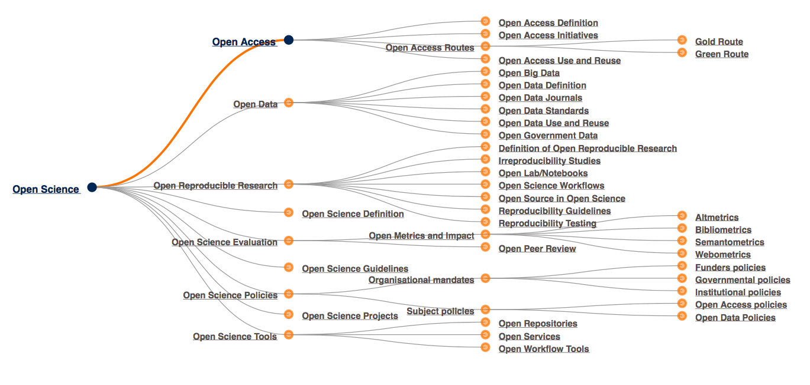

<figure><figcaption>
    figure 1. Open Science matrix (courtesy LIBER)</figcaption></figure>

This year’s International Open Access Week theme was <a href="http://www.action.openaccessweek.org">"Open in Action"</a>. The week (October 24 - 30, 2016) held a plethora of events, talks and other initiatives that presented, discussed and challenged various aspects from Open Access (OA) in academic publishing and scholarly communication, ranging from current trends, best practices and future prospects.

In fact, Open Access is just one of the many interrelated instances of Open Science or of Knowledge Commons that form a dense web of concepts, tools and practices (figure 1). It may be helpful, I would suggest, to consider Open Access, as another example of a “boundary object” in digital scholarship. A boundary object can be explained as an object or notion _"both plastic enough to adapt to local needs and constraints of the several parties employing them, yet robust enough to maintain a common identity across sites”_.<a href="#_ftn1" name="_ftnref1">[1]</a> Another example of a boundary object is ‘research infrastructure’<a href="#_ftn2" name="_ftnref2">[2]</a>(although OA is also an infrastructure-related concept). It follows that Open Access can mean many different things for various social groups, from universities, governments, research funders, research libraries to researchers; it is naively realistic in its very rationale and at the same time extremely complex in its implementation.

There is no single, easy, straightforward and inclusive answer to the question ‘What is the scope of and the roadmap towards OA?’. We can, however, always develop alternative ways to approach the issue. A couple of weeks ago<a href="https://www.martineve.com/2016/11/04/arguments-counter-arguments-and-political-alignments-for-and-against-open-access/">Martin Paul Eve</a> summarized few of the Open Access arguments for different social groups such as the taxpayer, the scientist, and the labour advocate. His summary made it quite clear that an empirical, almost idiosyncratic, set of experiences towards Open Access might help us to recognise and understand its importance in our lives. My aim in this post is not, of course, to discuss the full scope and definition of Open Access. Through the years, I tend to cultivate and adopt a more ‘grassroots approach’ towards Open Access, so I want to contribute to this year’s theme “Open in Action” by documenting and sharing four interrelated instances of my last year’s experience with Open Access in academic journal publishing.

##1.Multiple-Speed | Different Directions Open Access
Almost one and a half year ago, in the middle of a hot mediterranean afternoon of the 25th June 2015, the Hellenic Academic Libraries Link, the Greek National research libraries coalition, announced (figure 2) the termination of all contracts with academic publishers and content providers <a href="http://www.heal-link.gr/list_all_news.php">due to insufficient budget to pay off and renew subscriptions</a><a href="#_ftn1" name="_ftnref1">[3]</a> .As a result, Greek academics, researchers and students had to face, alongside the turmoil of the referendum and the capital controls, a new unpleasant reality where they couldn’t access a huge mass of scholarly content (including their own!) of the academic journals and large databases that are distributed by major academic publishers.

<figure><figcaption>
    figure 2. “the” HEAL-Link’s tweet</figcaption></figure>
    
Since then, several attempts were made to maintain access. First for three months only (grace period) but later this year enough funds were finally secured in order to maintain future access to online resources for the Greek academic community. I’ve tried to argue in several discussions and <a href="http://www.chronosmag.eu/index.php/s-s-psf-e-p.html">contributions</a> that this should not be considered only as a result of the current Greek economic crisis but should be understood as the dystopic or worst-case scenario of another crisis that is widely known as “serial crisis” in the research libraries world, i.e. the inability of libraries and institutions to afford journal subscriptions that are increasing both in number and in price. 
