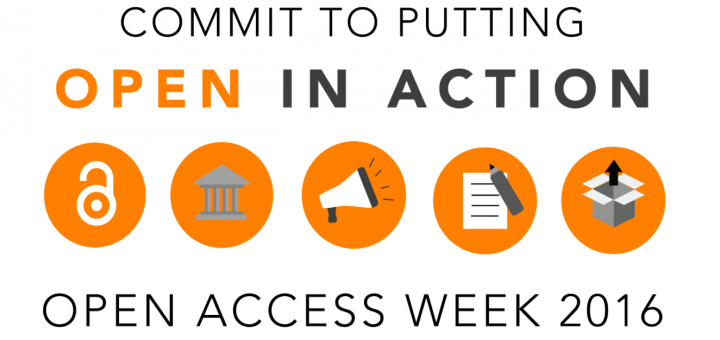
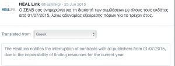
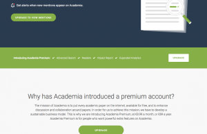
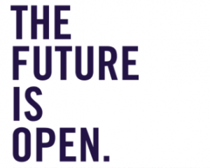

<figure></figure>
        
This year’s International Open Access Week theme was <a href="http://www.action.openaccessweek.org">"Open in Action"</a>. The week (October 24 - 30, 2016) held a plethora of events, talks and other initiatives that presented, discussed and challenged various aspects from Open Access (OA) in academic publishing and scholarly communication, ranging from current trends, best practices and future prospects.

In fact, Open Access is just one of the many interrelated instances of Open Science or of Knowledge Commons that form a dense web of concepts, tools and practices (figure 1). It may be helpful, I would suggest, to consider Open Access, as another example of a “boundary object” in digital scholarship. A boundary object can be explained as an object or notion _"both plastic enough to adapt to local needs and constraints of the several parties employing them, yet robust enough to maintain a common identity across sites”_.<a href="#_ftn1" name="_ftnref1">[1]</a> Another example of a boundary object is ‘research infrastructure’<a href="#_ftn2" name="_ftnref2">[2]</a>(although OA is also an infrastructure-related concept). It follows that Open Access can mean many different things for various social groups, from universities, governments, research funders, research libraries to researchers; it is naively realistic in its very rationale and at the same time extremely complex in its implementation.

<figure>
        <figcaption> figure 1. Open Science matrix (courtesy LIBER)</figcaption>
    </figure>

There is no single, easy, straightforward and inclusive answer to the question ‘What is the scope of and the roadmap towards OA?’. We can, however, always develop alternative ways to approach the issue. A couple of weeks ago<a href="https://www.martineve.com/2016/11/04/arguments-counter-arguments-and-political-alignments-for-and-against-open-access/">Martin Paul Eve</a> summarized few of the Open Access arguments for different social groups such as the taxpayer, the scientist, and the labour advocate. His summary made it quite clear that an empirical, almost idiosyncratic, set of experiences towards Open Access might help us to recognise and understand its importance in our lives. My aim in this post is not, of course, to discuss the full scope and definition of Open Access. Through the years, I tend to cultivate and adopt a more ‘grassroots approach’ towards Open Access, so I want to contribute to this year’s theme “Open in Action” by documenting and sharing four interrelated instances of my last year’s experience with Open Access in academic journal publishing.

## 1.Multiple-Speed | Different Directions Open Access
Almost one and a half year ago, in the middle of a hot mediterranean afternoon of the 25th June 2015, the Hellenic Academic Libraries Link, the Greek National research libraries coalition, announced (figure 2) the termination of all contracts with academic publishers and content providers <a href="http://www.heal-link.gr/list_all_news.php">due to insufficient budget to pay off and renew subscriptions</a><a href="#_ftn1" name="_ftnref1">[3]</a> .As a result, Greek academics, researchers and students had to face, alongside the turmoil of the referendum and the capital controls, a new unpleasant reality where they couldn’t access a huge mass of scholarly content (including their own!) of the academic journals and large databases that are distributed by major academic publishers.

<figure>
        <figcaption>
    figure 2. “the” HEAL-Link’s tweet</figcaption></figure>
    
Since then, several attempts were made to maintain access. First for three months only (grace period) but later this year enough funds were finally secured in order to maintain future access to online resources for the Greek academic community. I’ve tried to argue in several discussions and <a href="http://www.chronosmag.eu/index.php/s-s-psf-e-p.html">contributions</a> that this should not be considered only as a result of the current Greek economic crisis but should be understood as the dystopic or worst-case scenario of another crisis that is widely known as “serial crisis” in the research libraries world, i.e. the inability of libraries and institutions to afford journal subscriptions that are increasing both in number and in price. 

In my view, such an unpleasant situation like the one in Greece  constitutes  an ideal moment to critically reflect upon the politics and economics of scholarly publishing, and for more radical action towards Fair Open Access. The struggle towards Open Access to scholarly publications is a continuous and sometimes even quite alarming battle, from <a href="https://www.theguardian.com/science/2012/apr/24/harvard-university-journal-publishers-prices">Harvard </a>saying it can’t afford journals to the recent Greek example. This why it stands as one of the pivotal goals in the research and education agenda of  both institutions and governments.

While in Greece we have been struggling to secure (alternative) access to research publications for the academic community, in the Netherlands, where I am currently working, the Dutch government is actively paving the way to Open Access by offering strong political support. With the occasion of the Dutch EU presidency, the  Association of universities in the Netherlands (the VSNU) stands on the very forefront of establishing <a href="http://www.vsnu.nl/openaccess">OA for scholarly publications</a>for Dutch researchers. At the same time, the government actively supports mandates of an <a href="http://www.openaccess.nl">Open Science action plan</a>(e.g. the Amsterdam conference on 'Open Science – From Vision to Action' hosted by the Netherlands' EU presidency, 4-5 April 2016, resulting to the recent <a href="http://www.eu2016.nl/documenten/rapporten/2016/04/04/amsterdam-call-for-action-on-open-science">"Amsterdam Call for Action on Open Science"</a>). In line with the objective of Sander Dekker, State Secretary at the Ministry for Education, Culture and Science of the Netherlands, to transition Dutch scientific output towards an Open Access publishing model, VSNU has also initiated a number of <a href="http://www.openaccess.nl/en/themas-begrippenlijst/big-deal">"big deal negotiations"</a> with academic publishers, pushing them to take serious steps towards open access. For instance, Dutch universities now have an agreement with publishers where they will renew subscription agreements on the condition that the costs for the Article Processing Charges (APC) for authors with a Dutch affiliation have been bought off (by the government).

This looks like an almost utopian academic happyland: Dutch researchers are extremely lucky, both as readers and as authors of research articles, to be able to write and use scholarly output without paywalls; it is to be expected that the number of Dutch Open Access publications will significantly increase within the next years, as<a href="http://www.narcis.nl/?Language=nl"> Narcis</a> will document.<a href="#_ftn1" name="_ftnref1">[4]</a> . The other side of the coin is that a number of wealthy academic publishers that are successful partners of VSNU (such as <a href="http://vsnu.nl/files/documenten/Domeinen/Onderzoek/Open%20access/Ezine-OpenAccess-ENG-mrch2016.pdf">Elsevier, SAGE, Springer, Wiley, OUP, ACS, Taylor &amp; Francis</a> as of March 2016), will simply continue to grow their profit margins only this time in the name of Open Access, while an enormous part of the national research budget will go to APCs. Is that a fair deal?

## 2.Open Access and APC: inverting the business model

Earlier this year, two colleagues and I submitted an article for peer review in a international Humanities scholarly journal published by a major publishing house. The review process was relatively smooth and we finally arrived to the stage of manuscript copyright agreement, where we were asked to pay 2,750€ + taxes if we wanted our article to _“be published using the open access publishing model”_ (see figure 3). Both the publication fee that was asked (which comes down to the aforementioned  APC), and the guilty feeling that came over us ( if we didn't pay, our colleagues in Greece for example wouldn’t be able to access our research) forced us to withdraw the article from that journal and to search for another, full-OA publishing avenue. This is why I consider APC one of the major barriers for Open Access in general and especially for young academics. Let me put it clearly: I don’t know many - if any - early career researchers ready to spend almost a month’s salary (a full-time UK academic position in Salary Scale 6) to publish their research. It is more likely that they use their money to cover their complete travel expenses for one or more international conferences, or better yet: book an all inclusive two week cruise on the Mediterranean. Thus, young academics find themselves compelled to publish in a traditional subscription-based journal, simply because they can't afford to put their work anywhere else- causing them to risk falling foul of Open Access mandates.

<figure>

<figcaption>
figure 3. APC is calling ;) (zoom suggested, alcohol optional)</figcaption></figure>

Before I go on, it is important to clear up a huge misconception:(Gold) Open Access publishing is not synonymous with Article Processing Charges. APC or “the ‘author-pays’ business model” is an alternative method that publishing houses may employ rather than, for example, working with subscription fees or subsidies) in order to collect the budget required to cover publishing costs upfront (such as peer review management, administration costs, marketing, web hosting, and upkeep of online systems). For the most part, the money is still going to the same publishers who receive the highest subscription fees. While you could argue that an entirely APC-based journal publishing ecosystem is a more ethical and democratic inversion of the traditional subscription system, because it transfers the burden of the costs from libraries and readers to individual authors, this inversion in the business model is not effective. To be more precise: it doesn’t fix what is frankly a messed-up economic system. The profit still flows to the same corner (the publishers), only with different groups of the research community ending up paying for it each time (be it individual researchers, libraries, funders, or even governments in the Dutch case): _“the cure [might be] worse than the disease"_, as a <a href="http://www.arl.org/storage/documents/substituting-apcs-for-subscriptions-20july2016.pdf">white paper</a> recently issued by the Association of Research Libraries (ARL) argued.

Moreover, the APC pricing regime is in constant evolution: different academic publishers have widely varying levels of fees, (from £500 to £2000), some offer fee waivers to students or those not able to cover them and, not surprisingly, the OA week is the ideal period for APC ‘sales’ (e.g. <a href="http://explore.tandfonline.com/page/est/open-access-2015">the #Gold Friday </a>Competition<a href="http://authorservices.taylorandfrancis.com/publishing-open-access-with-goldfriday/">of Taylor&amp;Francis</a>). Nowadays, prestigious journals with high impact factors in most scientific disciplines tend to have the highest APCs, causing an alarming price competition between them. <a href="http://blogs.lse.ac.uk/impactofsocialsciences/2016/10/26/the-impact-of-article-processing-charges-on-libraries-and-what-is-being-done-to-help/?platform=hootsuite">Recent studies</a> that were initiated to map and monitor the market for APCs (eg.<a href="https://www.jisc.ac.uk/rd/projects/monitoring-open-access-activity">Jisc Monitor</a>) show that they are growing at an explosive rate and are becoming an increasingly important part of institutions’ spending or funders’ budgets. In this system, what is known as "Open Access Funds" (such as the <a href="https://ec.europa.eu/research/participants/data/ref/h2020/grants_manual/hi/oa_pilot/h2020-hi-oa-pilot-guide_en.pdf">Open Access to Scientific Publications and Research Data in Horizon 2020</a>) cause subscription expenditures to compete with APCs for their share of the research library's allocated budget. Given that not all scholars are equally invested in the politics and economics of academia and academic publishing, Open Access publishing in APC-based (or hybrid) journals still remains a privilege for those more or less possessing a secure academic job or working under a prestigious research grant, which could pay the -almost literally speaking- ‘golden’ OA publication fee for them.

## 3. Academic networking sites and Open Access

After the Greek interruption of journals’ subscriptions and given the inability of the majority of my early-career research colleagues to publish their work in a OA journal, I suddenly noticed a new fast-growing trend in scholarly communication: they started to join and to actively use academic/professional social networking sites such as Academia.edu, ResearchGate and Mendeley. 

This was a rather bizarre and yet telling coincidence. Such  platforms are becoming extremely popular with scholars as they present themselves as proponents of open access, by creating alternative mechanisms for sharing (not publishing!) final versions of their research (usually followed by several copyright infringements) which is already published elsewhere - usually in a paywalled journal. What these sharing platforms mainly lack is the symbolic prestige as well as the scholarly mechanisms for evaluation and assessment offered by a peer-reviewed scholarly journal - both key factors for career progression. Instead, they are offering an array of user-friendly web 2.0 networking features (bookmark, share, follow) as alternative credibility and reputation metrics in order to control a precarious scientific career using market competition rules. Their business model, thus, has nothing to do with Open Access model, even if many of their members that uploading their research on these portals is the equivalent to publishing open access. For example, behind their founding slogan "share research", the main business goal of Academia.edu is, according to CEO Richard Price, _“to provide trending research data to R&amp;D institutions that can improve the quality of their decisions by 10-20%”_<a href="#_ftn1" name="_ftnref1">[5]</a>.  While the fast-growing internet company  initially started with a multi-million capital from investors and offered its services for free, its business strategy has recently expanded with the launch of a premium version of the platform’s services under user charges (figure 4), moving further into the <a href="http://www.theguardian.com/commentisfree/2011/aug/29/academic-publishers-murdoch-socialist">highly-profitable</a> academic publishing market.

<figure>
 <figcaption>figure 4. Academia.edu's premium account  </figcaption></figure>

It’s true that is getting increasingly difficult to draw up best practices, procedures and roles in a new scholarly communication and publishing ecosystem, where publishers, networking platforms, funders, libraries, academic institutions and researchers are all actively using ‘Open Access’ as a Trojan horse for escaping from or surviving in an already-broken and problematic system. Meanwhile, researchers will continue to fight to publish their research in prestigious academic journals - journals that use subscription fees or APCs, profitable for the publishers but the content of which fewer and fewer of our peers will be able to access. At the same time, sharing and networking sites that popped up like academic dei ex machina,continue to provide a handy but deeply problematic avenue for communicating the pay-wall condemned but necessary-as-such journal publication.

## 4. Assessment and Impact in academic publishing: refining the value of Open Access

After summer, I received a message from a journal’s editor asking me to serve as a guest reviewer for a special issue. The journal has very good reputation in the (rather small) field of Modern Greek Studies, and the message was really warm. Still, a particular sentence caught my attention, namely a statement that _“according to the Thomson Reuters Journal Citation Reports, the journal has a 11 impact factor”_. I was really shocked not by the very fact that impact factors are used as a measure to showcase academic prestige, but because, suddenly, these impact factors were linked with peer-review, in the battle for academic assessment, recognition and reward.

Peer review acts as a quality control mechanism in scholarly communication. It entails the evaluation of  a research work by people of similar competence, and the assessment and  and insurance that  it’s suitable for publication in an academic journal. In my view, today’s peer review process, especially in Humanities, is under extreme pressure for two main reasons. First, both the massive growth in the amount of publishing and the huge (and largely on voluntary/unpaid basis) effort that is put into reviewing research papers often leads to a less robust evaluation process (causing even bad papers to get published), paradoxically in an effort to maintain the journal’s  status in the hierarchy. Secondly, peer-reviewed articles are not only used to communicate scientific research, but also to evaluate academic performance, to build career structures, and to inform internal research strategies and funding decisions in higher education institutions among others. This reinforces the ‘publish or perish’ dogma, celebrating quantity over quality and putting the lives and careers of both (young) academics and  peer-reviewers under huge pressure. To make a long story short, the only people who benefit from the intense pressure to publish are again those working in the publishing industry.

A tangible way to assess "productivity targets" in form of peer-reviewed articles is reflected on journals’ impact factors (IF). Impact factor, a measure reflecting the number of times an average article is cited during the previous two years, is frequently used as a proxy for the relative importance of a journal within its field (see the <a href="http://thomsonreuters.com/en/products-services/scholarly-scientific-research/research-management-and-evaluation/journal-citation-reports.html">_Journal Citation Reports_</a>e from Thomson Reuters). Even if the publication record in journals with high Impact Factor is used to accelerate career advancement,<a href="#_ftn1" name="_ftnref1">[6]</a> what we need to keep in mind is that the impact factor is a particularly poor and misleading metric for research assessment and academic excellence as it <a href="http://blogs.plos.org/plos/2016/07/impact-factors-do-not-reflect-citation-rates/">does not reflect individual article citation rates</a>. On the contrary, it is widely (mis-)used. As we see in the case of peer-reviewed publications, publishers use it for advertising, funders for assessment, and finally researchers for choosing where to submit their work.

In my view, Open Access can and should help us re-establish a value system for research assessment **beyond** market economics. It should further support researchers (both as authors and as peer-reviewers) to develop a balanced evaluation procedure towards their peers and to celebrate values of collegiality, equity and research excellence. Open Access is not only about free access to knowledge for its own sake, but also about enabling transparent and more constructive assessment (in form of open, peer-to-peer or post-publication peer review) as well as about increasing the productive communication and (re)use and thereby the progress of research itself.<a href="#_ftn1" name="_ftnref1">[7]</a> . To this goal, we can look at, recent developments such as the application of more sophisticated <a href="https://www.plos.org/article-level-metrics">article-level metrics</a>, the emergence of <a href="https://www.altmetric.com">altmetrics</a>, or even a system that will open up the multi-dimensional value of each article in its broader <a href="http://blog.scienceopen.com/2016/08/envisioning-the-next-generation-of-scholarly-communications/">context</a>. Furthermore,the adoption of <a href="http://blogs.plos.org/plos/2015/10/collaboration-improves-recognition-credit/">Open Researcher and Contributor ID </a>that can improve recognition and credit and a democratic discussion on the social value of research assessment: the <a href="http://www.ascb.org/dora/">San Francisco Declaration on Research Assessment (DORA)</a> and the <a href="http://www.nature.com/news/bibliometrics-the-leiden-manifesto-for-research-metrics-1.17351?WT.mc_id=TWT_NatureNews">Leiden Manifesto</a> are considerable steps in that right direction.

## Conclusion - Full Open Access Action in process

This post is of course based on my own idiosyncratic experiences of Open Access in academic journal publishing. Therefore, I want to conclude it with a more optimistic but at still realistic take. It is true that the interpretation and application of Open Science and Access vary across regions, disciplines, and stakeholders, but I strongly believe that a model for a more Fair Open Access for researchers is now possible: that of Full Open Access.<a href="http://www.triple-c.at/index.php/tripleC/article/view/502">Full or diamond Open Access </a>describes a non-commercial, non-profit open access publishing model without any reader- or author- facing fees. While research publications in this - still experimental - model celebrate academic knowledge as a free common good (especially when resulting from public funds or grants), publication costs still need to be met so several alternative business models have been explored to cover them. To this end, learned societies, universities, libraries, other non-commercial institutions and researchers themselves are collectively working hard to foster infrastructure and strategies for making full open access possible: from software solutions, such as the open-source <a href="https://pkp.sfu.ca/ojs">Open Journal Systems</a> from <a href="http://pkp.sfu.ca">Public Knowledge Project</a>, which significantly minimizes the management and publishing costs in journal publishing, to sustainable business models and funding strategies for enabling affordable fully open access publishing such as the <a href="https://about.openlibhums.org/2014/04/07/library-partnership-subsidies-lps/">Library Partnership Subsidies</a> currently employed by the <a href="https://www.openlibhums.org">Open Library of Humanities</a>, in order to facilitate open access publishing with no author-facing APCs, the MLA-enabled<a href="http://hcommons.org"> HumanitiesCommons</a>open access humanities repository and platform, and, finally, the disciplinary <a href="http://www.lingoa.eu"> Linguistics in Open Access foundation (LingOA)</a>, which will provide, within the relatively small field of linguistics, a framework for journals to make the move towards fair open access, thereby becoming a model for the transition to fair open access in other disciplines as well.

There is growing momentum to encourage Open Access, and I endorse and fight for full and fair Open Access in academic publishing. My reasons are simple: current discourse and facts clearly show that Open Access is not only ethical and reasonable, but also achievable. That universities, academics and the general public should benefit from academic research, and not private shareholders. That research labor as well as research funding and rewards should go back to research itself. I believe that the major hurdles facing full open access are not mere technological or economical. The transition towards not only open but also fair access to research outcomes and to knowledge in their various iterations produced within academia requires a wider and more thorough transformation of our academic culture. This includes publication, assessment, evaluation and promotion, an _“engineering [that] is less technical than it is social”_.<a href="#_ftn1" name="_ftnref1">[8]</a> For this, a radical new 'social contract' between publishers, universities, research libraries, funders, learned societies and researchers is needed; in the end, paraphrasing a Raymond Williams’ nice metaphor, we need to ask ourselves <em>“whether the known gold will be more widely spread, or whether, in fact, there will be a change of currency”</em><a href="#_ftn2" name="_ftnref2">[9]</a>.

## Note: 
Special thanks to my DiXiT co-fellows Elli, Wout, Elena and Aodhán for their useful comments and fruitful discussions on Open Access. The future is open and beckons.

## References

<a href="#_ftnref1" name="_ftn1">[1]</a> Star, Susan; Griesemer, James (1989). "Institutional Ecology, 'Translations' and Boundary Objects: Amateurs and Professionals in Berkeley's Museum of Vertebrate Zoology, 1907-39". _Social Studies of Science_. 19 (3): 387–420. doi:10.1177/030631289019003001

<a href="#_ftnref2" name="_ftn2">[2]</a> Sheila Anderson (2013), “What are Research Infrastructures?”,_International Journal of Humanities and Arts Computing_, Volume 7 Issue 1-2, 4-23

<a href="#_ftnref1" name="_ftn1">[3]</a> see entry of 24th June 2015

<a href="#_ftnref1" name="_ftn1">[4]</a> VSNU &amp; State Secretary expectation is that "in ten years from now (2024), 100 percent of Dutch scientific publications will be open access, with 60 percent being open access in five years (2019)", see <a href="http://www.vsnu.nl/en_GB/openaccess-eng.html">http://www.vsnu.nl/en_GB/openaccess-eng.html</a>

<a href="#_ftnref1" name="_ftn1">[5]</a> Hadas Shema, "Interview with Richard Price, Academia.edu CEO", _Scientific American_, October 31, 2012, <a href="https://blogs.scientificamerican.com/information-culture/interview-with-richard-price-academia-edu-ceo/">https://blogs.scientificamerican.com/information-culture/interview-with-richard-price-academia-edu-ceo/</a>

<a href="#_ftnref1" name="_ftn1">[6]</a> van Dijk D, Manor O, Carey LB (2014), "Publication metrics and success on the academic job market". _Current Biology_,24: p. R516–517. doi: 10.1016/j.cub.2014.04.039

<a href="#_ftnref1" name="_ftn1">[7]</a>  Martin Paul Eve (2013), “Before the law: open access, quality control and the future of peer review”. In: Vincent, N. and Wickham, C. (eds.) _Debating Open Access._ London, UK: British Academy, pp. 68-81.<a href="http://eprints.bbk.ac.uk/12215/1/Eve%20-%202013%20-%20Before%20the%20law.pdf">http://eprints.bbk.ac.uk/12215/1/Eve-2013-Before-the-law.pdf</a>

<a href="#_ftnref1" name="_ftn1">[8]</a> Kathleen Fitzpatrick (2011), _Planned Obsolescence: Publishing, Technology, and the Future of the Academy_, New York: New York University Press,  p.192

<a href="#_ftnref2" name="_ftn2">[9]</a> Raymond Williams (1958), _Culture and society 1780-1950_, Anchor Books Doubleday &amp; Company, Inc, p. 242

        
[originally published in <a href="https://dixit.hypotheses.org/1164">DiXiT Blog</a>]
