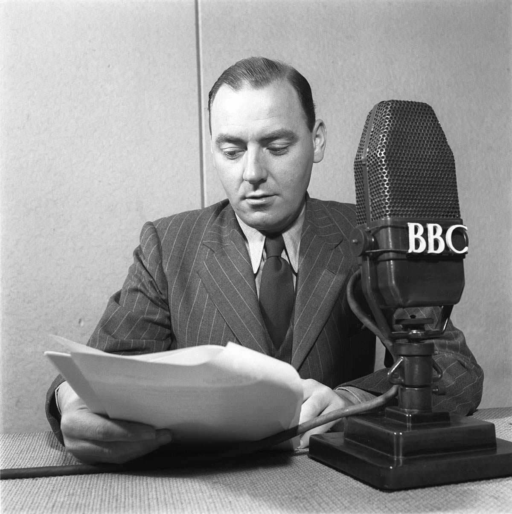

<figure></figure>
Frank Gillard in 1945 © BBC.

When I initially started working for ‘Connected Histories of the BBC’ as a PostDoc Research Fellow, almost a year ago, I naively felt rather confident about my knowledge of what an archive might contain. I have previously worked with various mainly textual-based archives for my PhD research, as well as for different Digital Humanities (DH) projects I was involved with in recent years. I am familiar with the “allure of the archives” but also with the undocumented, scattered, unexpected assets, the often chaotic structure of files, folders and boxes. I am aware of – and by now, trained in – how to treat and respect the original archival order, how to cite and use archival assets as a way to understand and narrate (often hidden) histories about the past.

But there is more that should interest us in an archive than archival assets. The historicity of the archival assets, linked to their very materiality, the historicity of the archival procedures, the documentation standards, the various archival catalogues produced throughout the years, the material aids and technologies, from paper clips to pencil marks and from handwritten paper catalogues to Excel spreadsheets; all of them are traces and agents of distinct moments in the history of the archive itself and, of course, they are of value themselves. One can experience all of these different archival qualities in the BBC Oral History Collection, and much more.

The BBC’s Oral History Archive was originally created in the early 1970s when Frank Gillard started recording audio interviews with key ex-BBC people to mark the 50th anniversary of the BBC in 1972. This was done under the Reminiscences of the BBC banner – presumably an internal name given to distinguish it from BBC programmes. The project and the interviews continued throughout the years. From the beginning though, the BBC Oral History collection contained much more than oral history recordings, in audio and, subsequently, in film: correspondence with interviewees, production material such as transcription notes, question sheets, consent forms, and so on.

In addition, the Collection has never been preserved or documented as a unified archive. Audio and audiovisual files have been preserved and documented at the BBC Written Archive Centre at Perivale and written assets (including correspondence, legacy transcripts and production material) have been stored and documented at the BBC Written Archives Centre. In the Written Archives there have been several distinct collections containing material from (or related to) the Oral History of the BBC. To complicate things further, there is also the ‘North Collection’, which includes interviews with BBC staff who worked over many years in the Corporation’s ‘North Region’ based in Manchester, and which used to operate as an independent collection.

Various cataloguing standards have been applied to all these assets through the years, resulting in a variety of filenames, multiple catalogues and audits of various formats. Moreover, different levels and qualities of archival information have been used to describe these assets and their relationships within those catalogues, and, alongside the recent digitisation of the material, they are posing additional challenges in terms of data provenance and accuracy. All these preservation and documentation attempts, alongside their subjects, have their own historical right and value: they also form ‘the archive’.

Working with the BBC Oral History Archive encompasses dealing with its historical legacy in every aspect. While we are trying, through this project, for the first time to bring together a scattered multimedia archive, we are also striving to make sense of various archival assets and their layered documentation. As a result, I now have a more comprehensive understanding of what an (oral history) archive might contain in terms of content but also in terms of its different materialities of archiving and documentation.

This has influenced my work on data modelling: for the digital archive we want to create for the BBC Oral History collection, I am assessing all the archival assets alongside all their information layers in order to develop a robust, clear and flexible data model, and an information architecture that will make this archive accessible in all its complexity and glory. In future posts, I will be able to share with you more technical aspects of the work we‘ll be doing. But for now…wish us luck and stay tuned!

**originally published: <a href="https://blogs.sussex.ac.uk/connected-histories-of-the-bbc/blogs/">The Connected Histories of the BBC blog </a>**
