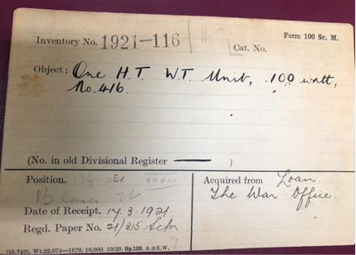
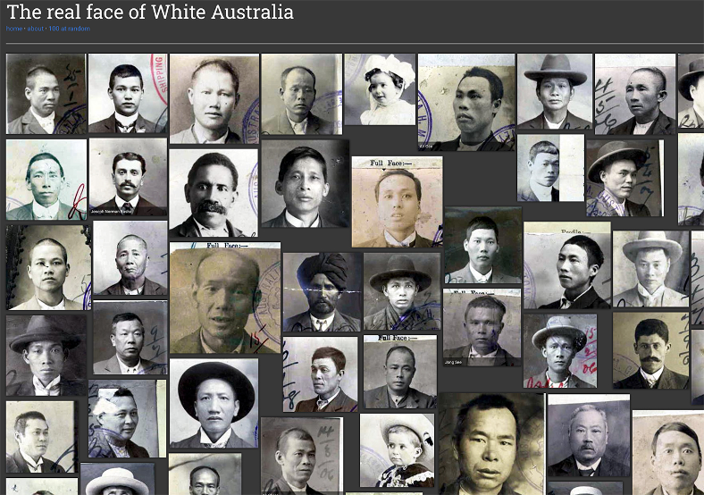
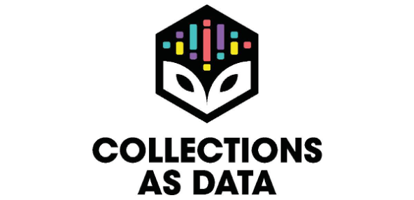

<figure></figure>

Ethics in Digital Humanities and digital scholarship has become a vivid topic of discussion and research in recent years (Rehbein 2015; Proferes 2020). Not surprisingly, it is in the field of Digital Cultural Heritage, especially with the emergence of large, varied and complex digital datasets as well as advanced, public-facing computational systems and methods, including AI, that a new set of ethical considerations have come to the forefront, mainly focused on biases at all stages and aspects of digital cultural heritage pipelines.

However, the word ‘bias’ tends to become some sort of a buzzword in the digital scholarship and cultural heritage world. As many of us are trying to navigate through what seems a rather complex and obscure ocean of meanings and to explore its implications in our research and professional practice, I have adopted a theoretical framework for studying bias proposed by Batya Friedman and Helen Nissenbaum back in 1996. According to them there are three categories of bias in the digital world:

- Pre-existing bias is rooted in social institutions and practices that predate the system.
- Technical bias arises when various technical properties of the systems created with false assumptions about their use are applied.
- Emergent bias arises in direct contact with users.

As part of the Congruence Engine project, I am exploring how technology choices affect curatorial as well as research processes and introduce biases in digital cultural heritage and research practice. My research is structured around this three-fold approach, by drawing examples and case studies from the project investigations and the wider digital cultural heritage field. For this blogpost, I will focus on the area of pre-existing bias in data found in cultural heritage institutions, in particular in museums.

**“RAW” AND “COOKED” DATA**

Data in general and more specifically in cultural heritage institutions is never raw. Borrowing an interesting metaphor from the information infrastructure scholar Geoffrey Bowker, data may be seen to be never entirely raw but is always already “cooked with care” (Bowker, 2005, 184). Indeed, “raw” carries a sense of natural, neutral or even untouched, whereas the very production and collection of data in heritage institutions already involves intentions, assumptions, and choices that amount to a kind of pre-processing. As Lisa Gitelman and Virginia Jackson point out in the introduction to their aptly titled “Raw Data” Is an Oxymoron (2013) book, “at a certain level the collection and management of data may be said to presuppose interpretation” (Gitelman & Jackson, 2013, 3).

No data collection process happens in a historical or institutional vacuum. The context and more importantly the politics of collection, preservation and dissemination, why and how something was collected, how it was (re)used, and finally how it was preserved and shared, are all always relevant, as are less accessible pieces of information within the data management lifecycle. Silence, absence, erasure, oblivion, incompleteness, gap, omission and uncertainty: every collection is inevitably biased and the idea of a representative and balanced museum collection is an illusion, unlikely to be reached ever, given that the act of collecting is a profoundly human, thus subjective, action besides the emergence of methodological principles and institutional policies.

Not surprisingly, silences and gaps are perpetuated – often magnified – in the digitisation projects of cultural heritage collections. Behind each digitisation project, there is a lengthy, multifactorial decision-making process on which records get digitised based on (financial and human) resources, technological or research priorities, user needs, preservation imperatives, and institutional politics, often reinforcing dominant narratives and practices in the heritage world (Taylor & Gibson 2017). All these decisions add yet another layer of silence and bias to the records that make their way into digital collections and online catalogues. Thus, what we get to see as final users today, in the form of online catalogues, is an accumulation of – or even an arbitrary choice from – the information compiled and stored on museum assets throughout the years of documentation practice in an ostensibly finalised digital repository representing many layers and agents of decisions, and, subsequently, an exponential multitude of biases.

<figure></figure>

Image 1: Science Museum ‘Form 100’ © SMG

<figure></figure>

Image 2: The online version of the object’s record © SMG H.T. W.T. unit, 100 watt, No. 416 | Science Museum Group Collection

**ENGAGING ABSENCES AND BIASES IN DIGITAL COLLECTIONS**

In an era of information abundance and big data deluge, it comes as no surprise that the absence of data hasn’t yet emerged as a major problem. Heritage organisations have always tended to favour the creation of public displays over the backroom tasks of object documentation, and so the collections records that are now digitally managed are most often not detailed. Curators know that the records are partial and work to overcome this wherever they can. In a similar vein, instead of sitting in reverential silence in the rooms of heritage institutions, silently reading from cultural records, Arts and Humanities researchers working with digital collections have recently started to read sources “against the grain.” They have begun to highlight silences by converting gaps, omissions and biases into research objects, embedding them in their digital research practice as formative factors for their results.

We can observe in recent heritage scholarship a diverse set of ways of “engaging absence” in collections from a methodological as well as functional point of view.  Nyhan & Ortolja-Baird (2021) offer a comprehensive survey of the current algorithmic approaches to absence and bias within digital humanities, both perpetuated and created anew by the increasing digital presence, representation, and interrogation of data. They call for a re-examination of the social and cultural factors that give rise to absences in digital collections. An interesting example is the project The real face of White Australia , originally called Invisible Australians, created by Kate Bagnall and Tim Sherratt (Image 3). On the other hand, Thomas Padilla vividly proposed that we should “treat data absence as an integral feature rather than a bug to be quashed” as part of a wider cross-sectoral move “to systematically qualify data absence as a means of shoring up grounds for a redefined notion of representativeness to stand upon” (Padilla 2018).

<figure></figure>

Image 3: The real face of white Australia project.

One way of engaging with gaps and absences in collections is by making them visible. Lauren Klein’s emblematic work The Image of Absence: Archival Silence, Data Visualization, and James Hemings demonstrates how a set of techniques that derive from the fields of computational linguistics and data visualization help render visible the archival silences within the wider digital scholarship field (Klein, 2013). Shannon Mattern’s excellent piece on  “How to Map Nothing” presents how cartographers and information managers, typically struggling to manifest silences and absences, have been recently engaged with several digital visualisation and mapping projects to document nothingness, with the assistance of new processing and visualisation techniques, including machine learning. Andy Kirk, a visualisation expert, also explores the challenges of designing different types of nothingness in his piece ‘The Design of Nothing‘.

Another way of engaging with gaps and biases in cultural heritage collections comes with the shift in thinking of ‘collections-as-data’ (pic. 4) rather than as discrete objects, and more precisely, by exploring how absences and biases are present in big data regimes and how they affect the outcomes and conclusions of digital analytical processes. Critique around the importance of understanding partial or biased data in digital scholarship and digital cultural heritage is not new, especially at a theoretical and methodological or even institutional level (Posner 2015; Kizhner et al. 2021; Nyhan & Ortolja-Baird 2021; Sever 2022), but there are relatively few studies which actually explore the  implications of absent or biased data in research outputs.

<figure></figure> 

Image 4: Always Already Computational • Always Already Computational – Collections as Data

In a recent paper exploring large-scale historical correspondence networks Ryan and Ahnert focused on the extent to which the results of quantitative network analysis are affected by absent data. They argue that “an important facet of this data curation is to understand its missingness, and, moreover, where possible, the effect that this might have on resulting quantitative results, whether they be, as in this case, network metrics, but also more generally: the same technique might be applied to measures derived from work in Computational Literary Studies or Spatial Humanities” (Ryan and Ahnert 2021).

In a similar vein, Matthew Lincoln and Sandra van Ginhoven have been using statistical tools such as data simulation and imputation to model the effect of missing source data on quantitative results and conclusions. According to them, these statistical methods “allow us to realize multiple, sometimes conflicting, assumptions about the nature of missing data. In doing so, these affordances allow us to evaluate how certain assertions may propagate their assumptions through the transformations we perform on our sources” (Lincoln & van Ginhoven 2018).

In another study, a group of researchers from the Living with the Machines project argue for “a new type of source criticism that explicitly addresses representativeness and biases in cultural heritage collections” (Beelen et al 2022, 2) by applying text mining techniques to a large digitised newspapers collection to map cultural transitions at scale. By proposing the ‘Environmental Scan’, a new approach to read large-scale historical sources in context and to address questions of bias in digital heritage, they claim that “our goal should not be to use our insights to aim at curating a ‘perfect’ sample. This would be a fool’s mission. Rather, it should be to use our enhanced understanding of the data to inform our analyses and nuance our interpretations” (Beelen et al 2022, 19). Finally, as there is an increasing demand for cultural heritage collections to be used as training data for Large Language Models in Machine Learning pipelines, there is a set of emergent considerations towards biases and absences in collections. These need to be addressed through deeper collaboration among institutions and stakeholders (van Strien 2023).

**TOWARDS A RESPONSIBLE BIAS MANAGEMENT PARADIGM**

A similar radical approach towards managing bias as an intrinsic property of historical and cultural records is also at the heart of recent cross-sectoral discussions as documented by the  Responsible Operations: Data Science, Machine Learning, and AI in Libraries report and initiative. This is as an alternative to working to eliminate and to remove bias from our data, “something to be understood and articulated, rather than ‘solved’” (Beelen et al 2022, 6).

The Responsible Operations taskforce further encourages cultural institutions, heritage professionals and researchers to adopt practices that will empower them to acknowledge and be transparent about their datasets and models through the adoption of Datasheets and Model cards. According to Padilla, “responsible operations call for sustained engagement with human biases manifest in training data, machine learning models, and outputs. In contrast to some discussions that frame algorithmic bias or bias in data as something that can be eliminated, [it] might be better served by focusing on approaches to managing bias. Managing bias rather than working to eliminate bias is a distinction born of the sense that elimination is not possible because elimination would be a kind of bias itself—essentially a well-meaning, if ultimately futile, ouroboros” (Padilla 2020).

Shifting the agony from eliminating bias towards a responsible bias management paradigm, acknowledges this very reality and works to integrate responsible engagement with bias and absences in cultural heritage institutions’ business-as-usual workflows and in our everyday digital research practices. In the end, embedding such an ethos in our work within the Congruence Engine, as part of the Towards a National Collection programme, should be among the requirements for a national digital cultural heritage collections infrastructure, especially while dealing with cultural heritage data at scale.

**BIBLIOGRAPHY**

Kaspar Beelen, Jon Lawrence, Daniel C S Wilson, David Beavan (2022), “Bias and representativeness in digitized newspaper collections: Introducing the environmental scan”, Digital Scholarship in the Humanities, https://doi.org/10.1093/llc/fqac037

Geoffrey C.Bowker (2005), Memory Practices in the Sciences, Cambridge, MA: MIT Press.

B. Friedman, and H. Nissenbaum (1996), “Bias in Computer Systems.” ACM Transactions on Information Systems, vol. Vol. 14, no. No. 3, pp. 330–47, https://doi.org/046-8188/96/0700–0330.

Lisa Gitelman & Virginia Jacks (2013), “Introduction” in: Gitelman Lisa (ed), “Raw Data” Is an Oxymoron , MIT Press, p.1-14

Inna Kizhner, Melissa Terras,  Maxim Rumyantsev,  Valentina Khokhlova, Elisaveta Demeshkova,  Ivan Rudov, Julia Afanasieva (2021), “Digital Cultural Colonialism: Measuring Bias in Aggregated Digitized Content Held in Google Arts and Culture,” Digital Scholarship in the Humanities 36, no. 3, pp 607–640  https://doi.org/10.1093/llc/fqaa055

Lauren F.Klein, (2013), “The Image of Absence: Archival Silence, Data Visualization, and James Hemings”, American Literature, Volume 85, Number 4,
DOI 10.1215/00029831-2367310

Matthew Lincoln and Sandra van Ginhoven (2018), “Modeling the Fragmented Archive: A missing Data Case Study from Provenance Research,” presented at the Alliance of Digital Humanities Organizations annual conference, 2018, Mexico City. https://kilthub.cmu.edu/articles/conference_contribution/Modeling_a_Fragmented_Archive_A_Missing_Data_Case_Study_from_Provenance_Research/12363059

Thomas Padilla (2018), “Engaging absence”, https://www.thomaspadilla.org/2018/02/26/engaging-absence/

Thomas Padilla (2020). ‘Responsible Operations: Data Science, Machine Learning, and AI in Libraries’. OCLC, 26 August 2020. https://www.oclc.org/research/publications/2019/oclcresearch-responsible-operations-data-science-machine-learning-ai.html.

Nicholas Proferes (2020), “What Ethics Can Offer the Digital Humanities and What the Digital Humanities Can Offer Ethics,” in Routledge International Handbook of Research Methods in Digital Humanities, Routledge.

Malte Rehbein (2015), “On Ethical Issues of Digital Humanities (Some Thoughts)”,  Digital Humanities Summer Institute, Victoria BC, Canada. https://www.geku.uni-passau.de/fileadmin/dokumente/fakultaeten/phil/lehrstuehle/rehbein/Dokumente/OnEthicalIssues-Preprint.pdf

Yann C. Ryan and Sebastian E. Ahnert (2021), “The Measure of the Archive: The Robustness of Network Analysis in Early Modern Correspondence”, Journal of Cultural Analytics, 6 (3), 10.7910/DVN/TF3Y0O

Hande Sever, (2020), “Biases within Digital Repositories: The Getty Research Portal,” Stedelijk Studies Journal 10 https://stedelijkstudies.com/journal/biases-within-digital-repositories/.

J Taylor, and LK Gibson. “Digitisation, digital interaction and social media: embedded barriers to democratic heritage”. International Journal of Heritage Studies, 23(5): 408–20.

Daniel van Strien, “Collections as training data?”, (2023) in : Chambers, Sally, Walsh, Melanie, Caswell, Michelle, Harder, Geoff, Okumura, Mercedes, Corrin, Julia, Baeza Ventura, Gabriela, Antonijevic, Smiljana, Knazook, Beth, Narlock, Mikala, Bailey, Jefferson, Neudecker, Clemens, Downie, J. Stephen, Layne-Worthey, Glen, van Strien, Daniel, Irollo, Alba, Whitmire, Amanda, Lee, James, Berry, Dorothy, … Ridge, Mia. Position Statements -> Collections as Data: State of the field and future directions (Version 1). Zenodo. https://doi.org/10.5281/zenodo.7897735, p.36-39.

**originally published: <a href="https://ceblog.sciencemuseumgroup.org.uk/2023/06/20/data-is-never-raw-ethics-and-biases-in-digital-cultural-heritage-collections/">The Congruence Engine blog</a>**
