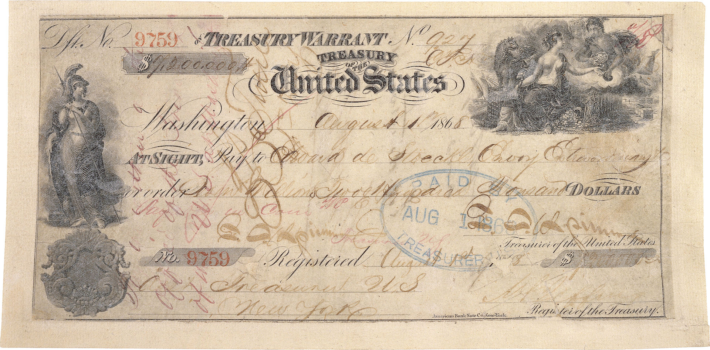

As part of my DiXiT fellowship, I aim to investigate, challenge and overall experiment with various concepts, business models and partnerships that will ensure for the digital scholarly edition a well-situated and sustainable future within the ecology of digital scholarly publishing and communication.

Central questions in my research are:

-What are the financial politics of digital scholarly editing?  What are the costs, the financial resources or the avenues for monetizing a digital edition?

-How we could train (ourselves as) digital editors to be more ‘businesslike’ and to adopt more entrepreneurial and business-planning mindsets (e.g. risk assessment, market analysis, product evaluation, user requirements etc) in keeping with high-quality scholarly standards as we run our digital editing projects?

Two related collaborative research publications are now on their way, one on the cost efficiency of crowdsourcing (using Transcribe Bentham as a case -study  ( update 24/1/2018 : read here our article <a href="https://academic.oup.com/dsh/advance-article-abstract/doi/10.1093/llc/fqx064/4810663?redirectedFrom=fulltext"> "‘Making such bargain’: Transcribe Bentham and the quality and cost-effectiveness of crowdsourced transcription"</a> ) and the second on monetization strategies for digital scholarly editions. Stay tuned.

