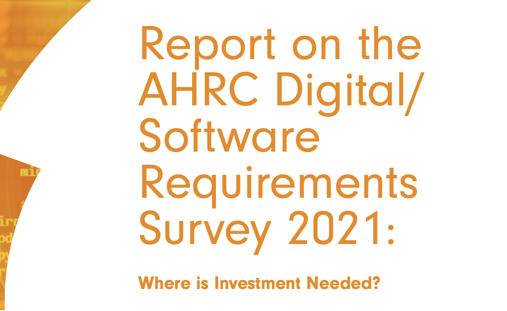

As part of my SSI and AHRC fellowships , with colleagues Shoaib Soaif and Dr Emily Bell I co-authored the <a href="https://zenodo.org/record/7686348#.ZEky3C1Q1qs">"Report on the AHRC Digital/Software Requirements Survey 2021"</a>.

The original survey run by the Software Sustainability Institute (SSI) on the Arts and Humanities Research Council (UKRI AHRC) community aimed to understand the views on digital/software tools, the experience of developing such tools, the practices, learning intentions and preferences around how to resource projects involving digital/software. Initially, the report intended to help inform the digital infrastructure funding developed by the AHRC. 

In its final form, we believe it will benefit the AHRC and other arts and humanities funders, the organisations which support arts and humanities research and practice, the communities of practice, the members of AHRC's community, and those wanting to learn more about these topics, whether to inform their own practice or to understand the field.

The report is available now, and its DOI is 10.5281/zenodo.7686347 

 
