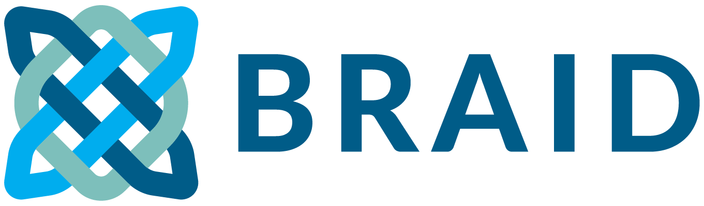

In November 2024 I started my BRAID fellowship on Responsible data, models and workflows: Responsible AI digital skills provision for the cultural heritage community. 

I initially began the fellowship in partnership with the Alan Turing Institute, collaborating with the Data/Culture team led by Professor Pieter François. As of 1st April, I have transitioned to collaborating with The National Archives, working with the Research team there and Dr Eirini Goudarouli.

My fellowship addresses the training needs for responsible AI adoption in the cultural heritage sector. ​By mobilising a cross-sectoral network through community-building events—such as focus groups, workshops, and edit-a-thons—this fellowship approaches responsible AI training for the cultural heritage community as a community-driven infrastructural investment and to foster a sustainable responsible AI research culture within the cultural heritage and research communities. These efforts are designed to empower cultural heritage professionals and researchers to navigate the complexities of AI adoption while upholding the principles of openness and ethical responsibility.

The fellowship will engage professionals and researchers to co-develop a flexible training framework—centred on communities of practice and covering topics such as responsible data, AI workflows, ethics, and case studies tailored to cultural heritage and research communities. Key outcomes will include a practical training workbench and a collaborative white paper with recommendations to strengthen responsible AI literacy across and beyond the sector.

The dates and place for the focus groups have now been confirmed - if you are willing to join, please drop me a line at annamaria.sichani@sas.ac.uk
