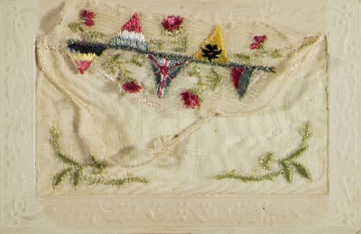

Given my strong interest and experience in data modeling as well as in digital representation and processing of modern manuscript sources, I am currently working towards a model for the encoding of correspondence material using TEI P5.

Parenthetically but of great importance: data modeling is a <a href="http://digitalhumanities.org/companion/view?docId=blackwell/9781405103213/9781405103213.xml&chunk.id=ss1-3-7"> central</a> but currently under-represented in scholarly literature topic in digital humanities (see the recent Volkswagen Foundation-funded project <a href="http://modellingdh.eu"> Modelling Between Digital and Humanities: Thinking in Practice</a>). I tend to see data modelling as the 'conceptual glue' between the understandings that scholars have of their research objects and the affordances of a particular computational technology. In our case, working with textual manuscript sources and their transcriptions and wishing to use/conform to TEI Guidelines, we need to develop a model in order to map our scholarly understndings/assumptions/needs to the TEI vocabulary and rules. 

Taking into account recent developments within the TEI community such as the <a href="http://www.tei-c.org/release/doc/tei-p5-doc/en/html/ref-correspDesc.html">correspDesc</a> extension and the <a href="http://correspsearch.net">CorrespSearch service</a>, I am now collaborating with the <a href="http://ctb.kantl.be/">CTB team</a> in order to revise the <a href="http://ctb.kantl.be/project/dalf/dalfdoc/index.html?ctb.mode=minimal&&base=../&scripts.base=scripts-style/&p=true">DALF guidelines</a> into a TEI P5 version and to customize them in order to include recent developments and case-specific features of correspondence material. 

To this end, we are using as test-beds several correspondence corpora, such as material from the Archive of Modern Greek Correspondence, a research initiative of the Cultural Foundation of the National Bank of Greece, as well as from the corpus of Guido Gezelle's letters. 

