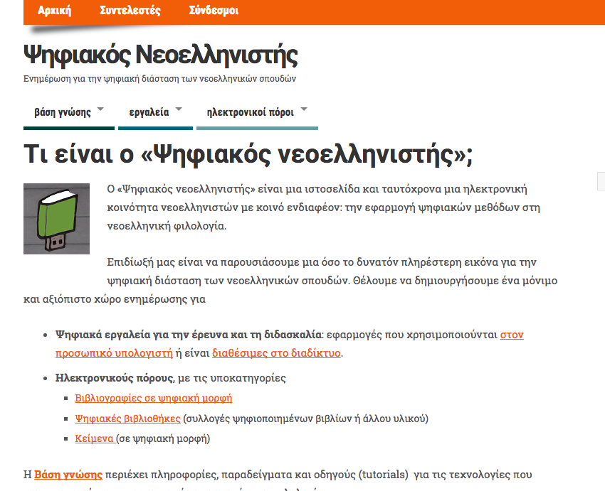

  
  
**<a href="http://www.digitalneohellenist.org">Digital Neohellenist</a>** attempts to built a virtual place as well as a community of Modern Greek scholars who share  a common interest towards the application of digital tools and methods in Modern Greek Literature.

Together with  the awesome <a href="http://www.toufexis.info/"> Notis Toufexis</a>, we collect and present  updates on digital services related to the Modern Greek Philology such as : 
<ul>
<li>digital tools</li>
<li>electronic resources</li>
<li>digital bibliographies</li>
<li>digital libraries</li>
<li>collections of electronic texts</li>
<li>tutorials for technologies and tools</li>
<li>mall pilots for digital editions.</li>
</ul>

We are constantly looking forward for collaborations and new ideas! So, if you wish, please do drop us a line!
