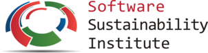

Here you can find a number of the projects I 've been initiated or helping developed as well as few works-in-progress. 

-----------------------------------------
  <ul class="projects-images">
 <li>
    <a href="../projects/ssi">
      
      <h2>Software Sustainability Institute Fellowship </h2>
    </a>
  </li>  
     <li>
    <a href="../projects/dhgr">
      
      <h2> The Greek Digital Humanities Research Network | Ελληνικό Ερευνητικό Δίκτυο Ψηφιακών Ανθρωπιστικών Επιστημών </h2>
    </a>
  </li>
   <li>
    <a href="../projects/distantreading">
      
      <h2> Distant Reading for European Literary History </h2>
    </a>
  </li>
<li>
    <a href="../projects/senseflows">
      
      <h2> Senseflows : Sensorial Flows in Salonica at the Transition from the Ottoman Empire to the Greek State </h2>
    </a>
  </li> 
  <li>
    <a href="../projects/otheritages">
      
      <h2> Otheritages: Histories, Spaces and Heritages at the transition from the Ottoman Empire to the Greek State </h2>
    </a>
  </li>
  <li>
    <a href="../projects/borndigitalarchive">
      
      <h2>Memory technologies: politics and practices of (born-)digital archives </h2>
    </a>
  </li> 
  <li>
    <a href="../projects/correspondence">
      
      <h2> Data modelling and encoding: Digital Editions of Correspondence material </h2>
    </a>
  </li>
 <li>
    <a href="../projects/DSEcosts">
      
      <h2> Cost efficiency and monetization models for Digital Scholarly Editions</h2>
    </a>
  </li> 
<li>
    <a href="../projects/sustainability">
      
      <h2>Sustainability and Maintenance of Digital Humanties Projects </h2>
    </a>
  </li> 
  
 <li>
   <a href="../projects/introducingDH">
      
      <h2>Introducing Digital Humanities through genre pieces and intellectual maps</h2>
   </a>
  </li>
    <li>
    <a href="../projects/greekopenaccess">
      
      <h2>Greek Humanities and Open Access </h2>
    </a>
  </li> 
  <li>
  <a href="../projects/digital-neohellenist">
      
      <h2>Digital Neohellenist</h2>
    </a>
  </li>
  <li>
    <a href="../projects/dhtrip">
      
      <h2>DH t(r)ip της Παρασκευής: News, views, and guides to the DH landscapes</h2>
    </a>
  </li>
</ul>

