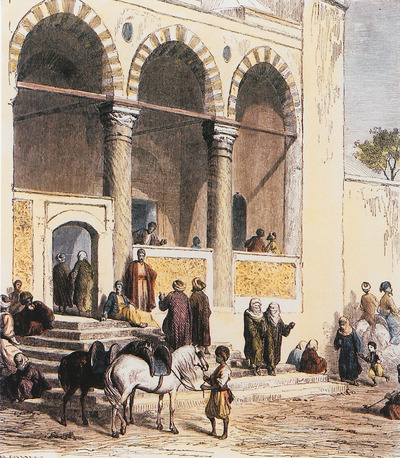

<figure>
  </figure>

<a href="https://otheritages.efa.gr">Histories, Spaces and Heritages at the transition from the Ottoman Empire to the Greek State</a> is a research project that explores the historical trajectories of urban space from the Ottoman Empire to the modern Greek State. 
The histories and/or ‘stories’ of this shifting urban space are studied in their intersensorial dimension, highlighting the dynamic interplay between materiality and its multifaceted conceptualizations.
This project brings together methodological tools and analytical concepts from the fields of cultural history, archaeology, urban studies, ethnomusicology and anthropology, a multidisciplinary model that interacts with the current trends in the broader field of digital humanities both on a local and international level.
Highlighting the perception of social space though the senses of hearing, smelling, touch and particularly through their interrelation contrasts the conventional ocular-centric approaches towards the histories of Ottoman urban space, thus contributing to the broadening of historical perception. The implementation of this approach serves the need for a competent analytical tool to tackle the challenges that the study of transition as a dynamic political and social process poses to researchers.
The project is currently funded by the French School at Athens (École Française d’ Athènes).

I am collaborating with Otheritages project as member of the Digital Humanities Unit. Our main goal is to develop a methodological model for structuring and processing cross-domain historical sources in various formats (pictures, sounds, maps, manusrcipt sources) and a mapping /visualisation model for studying the sensory history of Ottoman urban spaces in transition.
  
