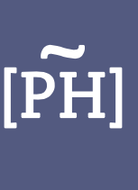

<a href="https://programminghistorian.org">The Programming Historian</a> is a peer-reviewed, multilingual (English, French, Spanish and Portuguese) academic journal of digital humanities and digital history methodology.  The Programming Historian publishes novice-friendly, peer-reviewed tutorials that help humanists learn a wide range of digital tools, techniques and workflows to facilitate research and teaching.  

I hold various (voluntary) positions within the PH project: I am a member of the Editorial Board and an editor for the English publication, while also acting as Educational manager, responsible for the overall educational agenda and profile of the project. I am also a Director of the ProgHist LtD, a UK-based charity currently administering the project and offering services to Programming Historian publications.

